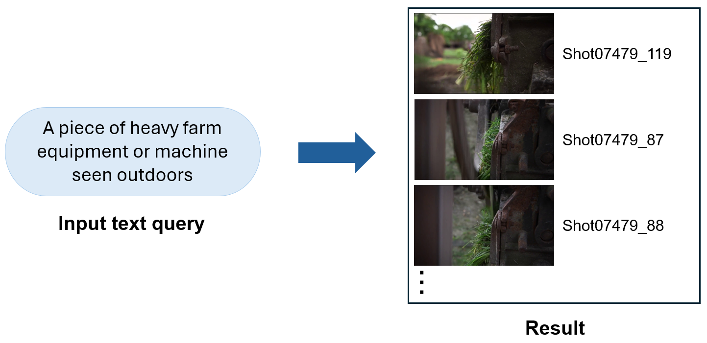
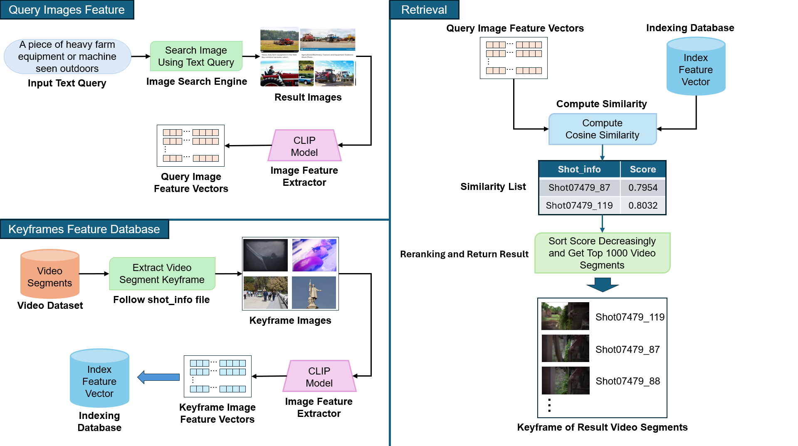

# Text Query to Web Image to Video: A Comprehensive Ad-hoc Video Search
## Member Info 
**Instructor:** PhD. Mai Tien Dung - University of Information Technology - Ho Chi Minh VNU

**Members**

|     Full name     | Student ID |  Role  |
| :---------------: | :--------: |  :---: |
| Nguyen Nhat Minh  | 21521135   |  Owner |
## Project Info
### 1. Introduction
The Ad-hoc search task goal is to model the end user search use-case, who is searching (using textual sentence queries) for segments of video containing persons, objects, activities, locations, etc. and combinations of the former.  

|                           
  
                            |
| :---------------------------------------------------------------------------------------------------------: |
|                                     Example for Ad-hoc Video Search                                         |

### 2. Methodology
This project experimentally implements a new approach to the Ad-hoc Video Search problem. 

Different from the methods that achieve the best results today, my method does not use Diffusion Models, but exploits the search capabilities of today's major search engines such as Google, Bing, Yahoo.

|    |
|:------------------------------------:|
|         Framework of Method          |